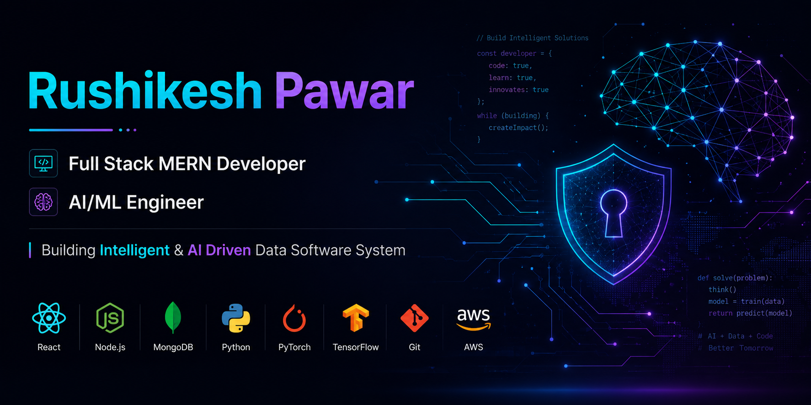

  

# Hi 👋 I'm Rushikesh Pawar

### Full Stack MERN Developer | AI/ML Engineer

Building Intelligent & AI-Driven Data Software Systems.

## 👨‍💻 About Me

- 🎓 B.Tech Computer Science Engineering Student
- 💻 Full Stack MERN Developer
- 🤖 AI & Machine Learning Enthusiast
- 📊 Aspiring Data Scientist & Machine Learning Engineer
- 🚀 Building intelligent, scalable, and AI-driven software systems

  ## 🛠️ Tech Stack

### 💻 Programming Languages

### 🌐 Frontend Development

### ⚙️ Backend Development

### 🗄️ Databases

### 🤖 AI / Machine Learning

### ☁️ Cloud & Tools

